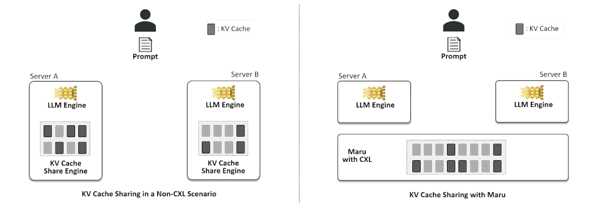

Maru
====

.. _maru-overview:

Overview
--------

`Maru <https://github.com/xcena-dev/maru>`_ is a high-performance KV cache storage engine built on CXL shared memory,
designed for LLM inference scenarios where multiple instances need to share a KV cache with minimal latency.

For architecture details, see the `Maru documentation <https://xcena-dev.github.io/maru/>`_.

Quick Start
-----------

Install Maru:

.. code-block:: bash

    git clone https://github.com/xcena-dev/maru.git
    cd maru
    ./install.sh

This installs ``maru-server``, ``maru-resourced``, and the ``maru`` Python package.

Deploy Model With Maru
~~~~~~~~~~~~~~~~~~~~~~

**Prerequisites:** CXL device (``/dev/dax*``), Python 3.12+, vLLM and LMCache installed.

**1. Start the Maru Server**

.. code-block:: bash

    maru-server

**2. Create configuration file** (``maru-config.yaml``):

.. code-block:: yaml

    chunk_size: 256
    local_cpu: True
    max_local_cpu_size: 5
    remote_url: "maru://localhost:5555"
    remote_serde: "naive"

    extra_config:
      maru_pool_size: "4G"
      save_chunk_meta: False

**3. Start vLLM with Maru**

.. code-block:: bash

    LMCACHE_CONFIG_FILE="maru-config.yaml" \
    vllm serve \
        meta-llama/Llama-3.1-8B-Instruct \
        --max-model-len 65536 \
        --kv-transfer-config \
        '{"kv_connector":"LMCacheConnectorV1", "kv_role":"kv_both"}'

Configuration
-------------

**LMCache Parameters:**

.. list-table::
   :header-rows: 1
   :widths: 25 15 60

   * - Parameter
     - Default
     - Description
   * - ``remote_url``
     - Required
     - Maru server URL (format: ``maru://host:port``)

**Maru Parameters (via extra_config):**

.. list-table::
   :header-rows: 1
   :widths: 25 15 60

   * - Parameter
     - Default
     - Description
   * - ``maru_pool_size``
     - ``"1G"``
     - CXL memory pool size per instance (e.g., ``"4G"``, ``"500M"``)
   * - ``maru_instance_id``
     - auto UUID
     - Unique client instance identifier
   * - ``maru_operation_timeout``
     - 10.0
     - Per-operation timeout in seconds
   * - ``maru_timeout_ms``
     - 2000
     - ZMQ RPC socket timeout in milliseconds
   * - ``maru_use_async_rpc``
     - true
     - Async DEALER-ROUTER RPC (``false`` for synchronous REQ-REP)
   * - ``maru_max_inflight``
     - 64
     - Max concurrent async RPC requests
   * - ``maru_eager_map``
     - true
     - Pre-map all shared regions on connect

Additional Resources
--------------------

- `Maru GitHub Repository <https://github.com/xcena-dev/maru>`_
- `Maru Documentation <https://xcena-dev.github.io/maru/>`_
